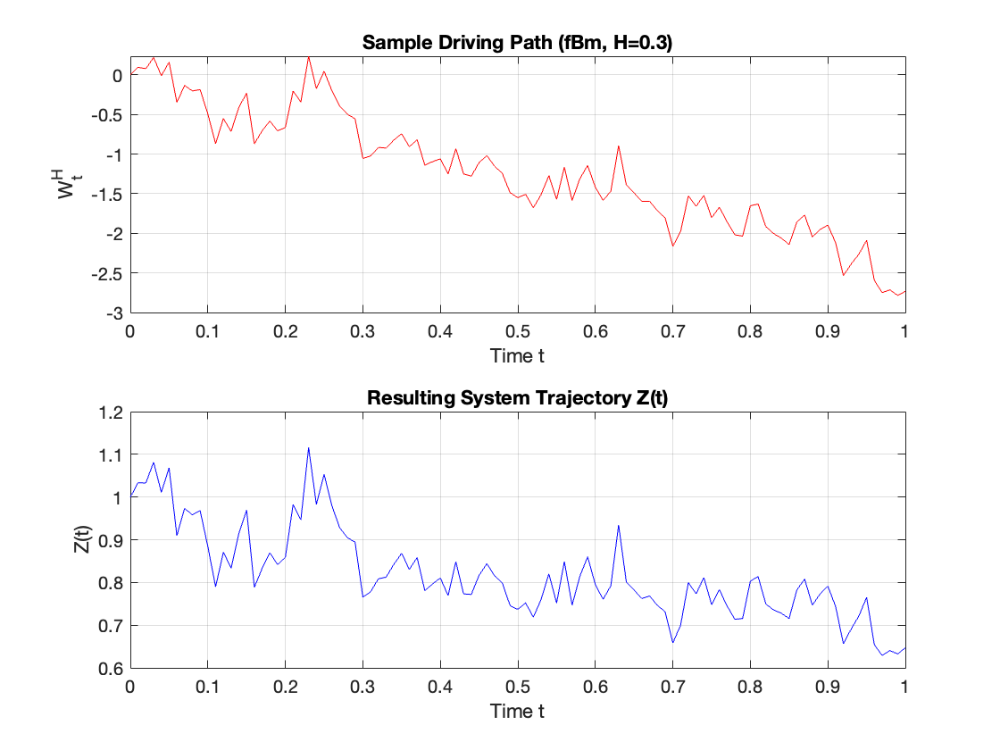

# Signature-Based Koopman Learning for Rough Stochastic Systems

This repository contains code to validate the use of signature transforms for Koopman learning on a nonlinear system driven by fractional Brownian motion (fBm).

## 📁 File Structure
- `main_koopman_signature_experiment.m` – Runs the full experiment.
- `fbm_generator.m` – Generates fBm paths using the Davies-Harte method.
- `solve_rough_sde.m` – Euler-Maruyama solver for the stochastic Duffing system.
- `calculate_final_signature.m` – Computes path signature at final time.
- `generate_indices.m` – Generates all truncated multi-indices.

## ▶️ How to Run
Run the main script:

